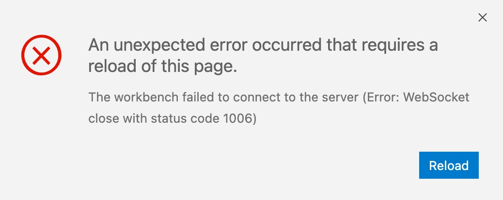

# RSW on Databricks

## Setup
Initial instructions are provided by Databricks here: https://docs.databricks.com/spark/latest/sparkr/rstudio.html

These instuctions suggest using a floating license server with RSW. In order to simplify things, it may be prefereable to use a license file. Databricks uses the construct of an "init script" to manage the installation of additional tools (like RSW) into a Databricks cluster. The init script used is maintained in this repository as [`rstudio-simple-init.sh`](rstudio-simple-init.sh). This file is modified from the [example](https://docs.databricks.com/spark/latest/sparkr/rstudio.html#install-rstudio-workbench) provided by Databricks

## License Management
Various attempts have been made to successfully and securely use an RStudio license file to run RSW on Databricks. So far, the only thing that has successfully worked has been to include the license file directly inline with the init script:

```
  sudo echo """
-----BEGIN RSTUDIO LICENSE-----
********************************
********************************
********************************
-----END RSTUDIO LICENSE-----
""" >> /etc/rstudio/rsw.lic
```

However, this pattern prevents the init script from being checked into version control since it contains the full contents of the license file. Other approaches that have been tried but havn't yet proved successful are storing the license file in DBFS and copying it into the instance in the init script and storing the license file as a secure secret on databricks and accessing it using the `databricks` CLI.

It's worth noting that it's possible to start a Databricks cluster with an evaluation version of RSW that doesn't require a license. This is the approach that's currently used, since this is a short-term exploratory environment.

## Observations
Running `sudo rstudio-server verify-installation --verify-user=user` passes all checks:

```
root@0815-194358-q320a4cf-10-152-243-2:/databricks/driver# rstudio-server verify-installation --verify-user james@rstudio.com
TTY detected. Printing informational message about logging configuration. Logging configuration loaded from '/etc/rstudio/logging.conf'. Logging to '/var/log/rstudio/rstudio-server/rserver.log'.
Checking Job Launcher configuration...
Ensuring server-user is a Job Launcher admin...
Getting list of Job Launcher clusters...
Job launcher configured with the following clusters: Local
launcher-adhoc-clusters is empty - all clusters may be used to launch adhoc jobs
launcher-sessions-clusters is empty - all clusters may be used to launch session jobs
Launched R session job for cluster Local
Waiting for job to run...
Job transitioned to status Pending
Job is running
Waiting for job to finish...
Job has finished running 
Job exited successfully
Launched adhoc job for cluster Local
Waiting for job to run...
Job transitioned to status Pending
Job is running
Waiting for job to finish...
Job has finished running 
Job exited successfully
Launched JupyterLab session job for cluster Local
Waiting for job to run...
Job transitioned to status Pending
Job is running
Fetching job output...
Jupyter session is running successfully
Launched Jupyter Notebook session job for cluster Local
Waiting for job to run...
Job transitioned to status Pending
Job is running
Fetching job output...
Jupyter session is running successfully
Launched VS Code session job for cluster Local
Waiting for job to run...
Job transitioned to status Pending
Job is running
Fetching job output...
VS Code session is running successfully
No errors
```

The following observations have been made when trying to use Local Launcher enabled RSW in Databricks:

### RStudio IDE
The IDE loads and behaves largely as expected. Multiple versions of R are recognized and can be selected. The one thing that *still* doesn't work correctly is Shiny applications. The application starts, but then immediately greys out, which is a strong indicator of websocket issues. The console confirms this with the following message:

```
WebSocket connection to 'wss://dbc-dp-3841524315580389.cloud.databricks.com/driver-proxy/o/3841524315580389/0815-194358-q320a4cf/8787/s/267a0cfc78a31f5ea4e61/p/e7a113bd/websocket/' failed: 
n @ shinyapp.ts:319
```

### JupyterLab
If a JupyterLab session is launched and left alone, it's status changes to `FINISHED` and the session is inaccessible. It's unclear why the status changes.

If a session is launched and joined immediately, then the JupyterLab UI loads. However, the only Launcher options presented are Terminal, Text File, Markdown File, and Show Contextual Help. Any Python-related functionality (Notebook and Console) is absent. There's no running kernel, and the kernel dropdown menu is completely greyed out.

Notebook and Console both appear in the File -> New menu but selecting either results in the following message:

```
# Error
Invalid response: 200
```

The files pane shows the current user home directory, but it can't be interacted with - new files can't be created, and existing directories can't be opened.

After exploring around in JupyterLab and then navigating back to the home page, the status of the session is again set to `FINISHED`, which may explain why JupyterLab acts like a weird shell of itself.

#### Terminal
```
# Launcher Error
Unexpected token '<', "<!DOCTYPE "... is not valid JSON
```

#### Text File
```
# Error
Invalid response: 200
```

#### Markdown File
```
# Error
Invalid response: 200
```

#### Show Contextual Help
Launches contexual help pane

### Jupyter Notebooks
If a Jupyter Notebook session is launched and left alone, it's status changes to `FINISHED` and the session is inaccessible. It's unclear why the status changes.

If I auto-join the session, I get a 404: Not Found page:


### VS Code
VS Code sessions launch, but users are immediately met by the following error:



Reloading the page results in the same error. The webtools console is filled with errors, which can be found [here](logs/vs-code-web-console.log).
